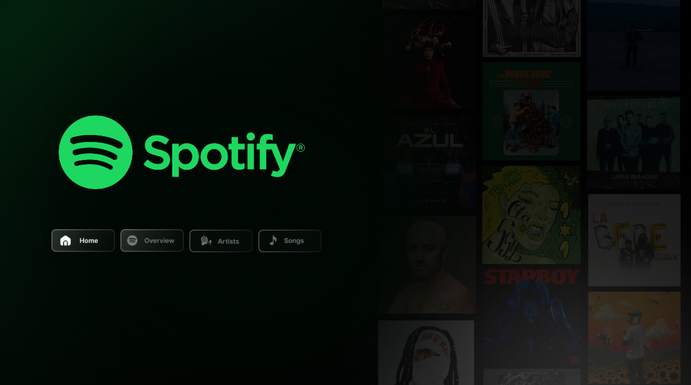
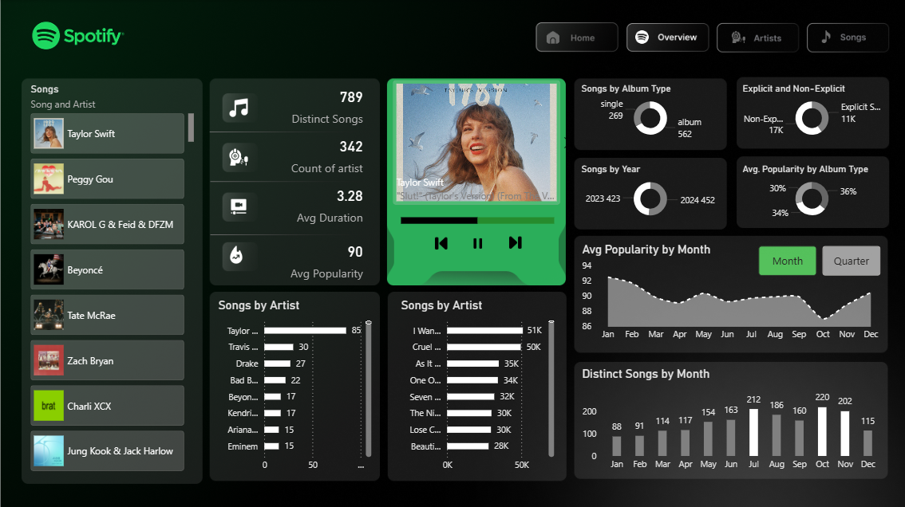
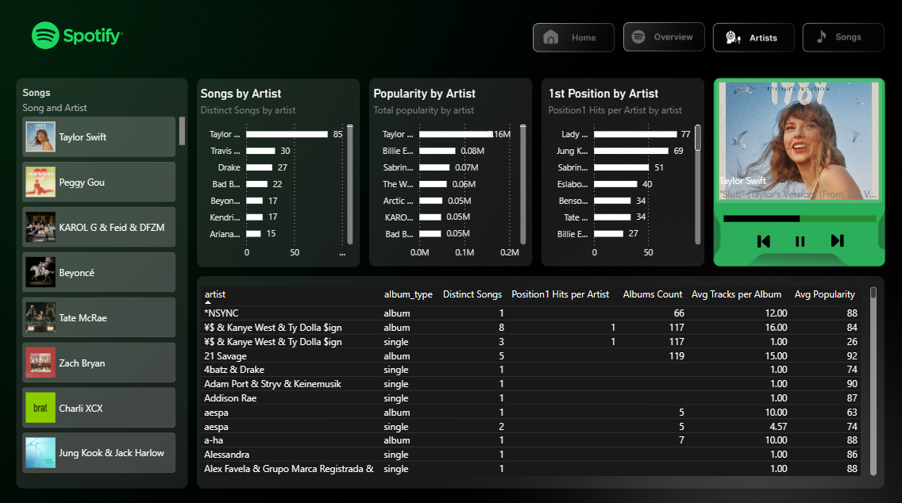
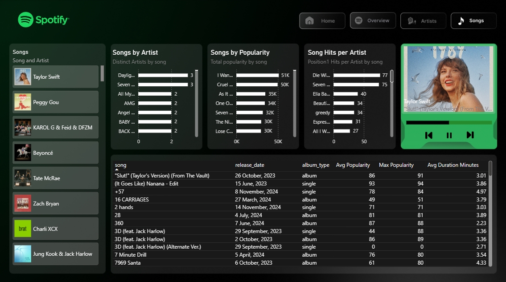

# 🎵 Spotify Data Dashboard - Power BI

This Power BI project visualizes insights from Spotify's Top 50 songs dataset, focusing on artists, albums, song popularity, and listening trends.

---

## 📊 Dashboard Overview

### 🏠 Home Page
- Modern Spotify-inspired UI
- Navigation menu for Home, Overview, Artists, and Songs

### 📈 Overview Page
- Distinct songs and artists count
- Average duration and popularity
- Insights by album type and year
- Monthly and quarterly popularity trends
- Artist and song performance breakdowns

---

## 📂 Dataset
**File:** `spotify-top-50-world.csv`

- Contains details like track name, artist, streams, duration, genre, and popularity.
- Source: Spotify Top 50 Global Chart

---

## 🧠 Tools & Technologies
- **Power BI** for data visualization
- **Excel / CSV** for preprocessing
- **GitHub** for version control and project showcase

---

## 🖼️ Dashboard Screenshots

### Home Page

### Overview Page

### Artist Page

### Songs Page

---

## 🚀 How to Use
1. Download the `.pbix` file.
2. Open it in **Power BI Desktop**.
3. Explore the visuals and data model.

---

## 💡 Insights
- Songs counts and popularity.
- Album-type distribution skews heavily toward singles.
- Popularity fluctuates across months with a strong upward trend in Q4.

---

⭐ *If you liked this project, don’t forget to give it a star on GitHub!*

